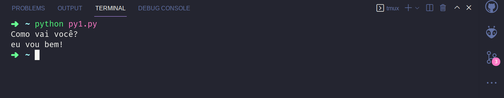
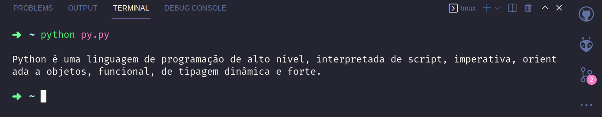
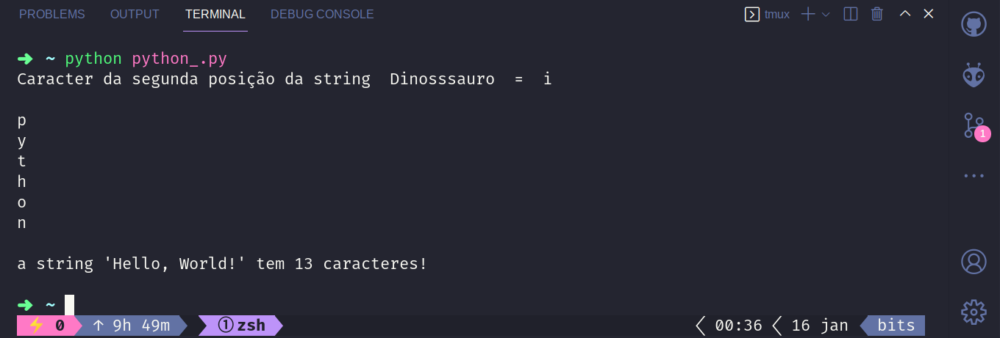

Aprenda a programar com Python:

<iframe width="100%" height="440" src="https://www.youtube.com/embed/videoseries?list=PL5jigOsyxDtCGEdY1I0Ymmv4lOyUkWbm2" title="YouTube video player" frameborder="0" allow="accelerometer; autoplay; clipboard-write; encrypted-media; gyroscope; picture-in-picture" allowfullscreen></iframe>


String é um tipo de dado primitivo do Python, dessa forma, é muito importante entender sua estrutura para podemos manipula-la.

## **Strings**

Para definir uma string em Python basta coloca-la entre aspas simples  <span style="color:MediumSeaGreen">'Olá Mundo!'</span> ou aspas duplas  <span style="color:MediumSeaGreen">"Olá Mundo!"</span>.

Com a função <a href="https://enghash.github.io/funcao-print-do-python/" target="_blank">print()</a> você pode escrever a string no terminal.

```python
# Salve a string em uma variável e depois escreva
# print ela no console.
string = "Como vai você?" 
print(string)

# ou print diretamente, passando a string para
# a função print()

print('eu vou bem!')
```

#### **Saída:**

<div>

</div>

Caso você tenha um texto grande e queira usá-lo como uma string, você pode usar três aspas duplos na <span style="color:MediumSeaGreen">"""Olá Mundo!"""</span>.

```python
frase = """
Python é uma linguagem de programação de alto nível, interpretada de script, imperativa, orientada a objetos, funcional, de tipagem dinâmica e forte.
"""
print(frase)
```
#### **Saída:**

<div>

</div>

Ou ainda, por três aspas simples <span style="color:MediumSeaGreen">'''Olá Mundo!'''</span>.

```python
frase = '''
Python é uma linguagem de programação de alto nível, interpretada de script, imperativa, orientada a objetos, funcional, de tipagem dinâmica e forte.
'''
print(frase)
```
#### **Saída:**

<div>

</div>


## **Outras Caracteristicas de Strings**


### **Exemplos**

```python
# Você consegue acessar possições de uma string
var = "Dinosssauro"
print("Caracter da segunda posição da string " ,var," = ", var[1], "\n")

# Você pode usar uma string em um FOR e percorrer 
# casa posição dela.
for x in 'python':
  print(x)

# Você pode obter o Comprimento da string usando a
# Função len() e passando a string dentro dela.
a = "Hello, World!"
print(f"\na string '{a}' tem {len(a)} caracteres!\n")

```

#### **Saída:**

<div>

</div>

<br>

Esperamos tê-lo(a) ajudado(a) a sanar suas dúvidas. Até o próximo post…


